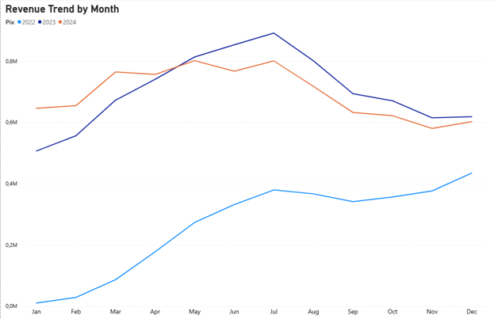
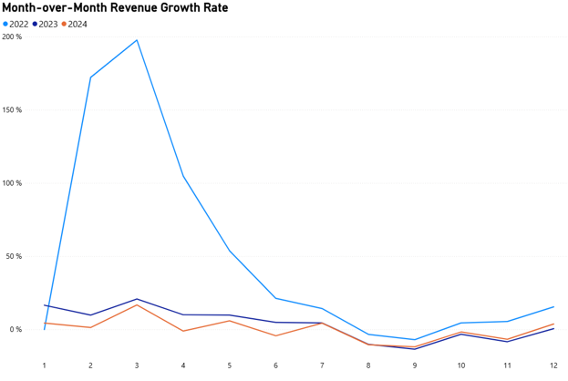
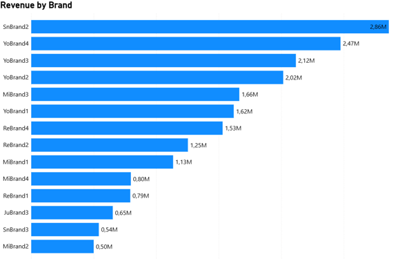
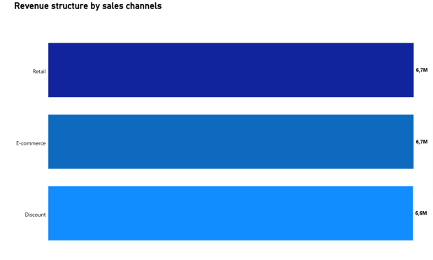
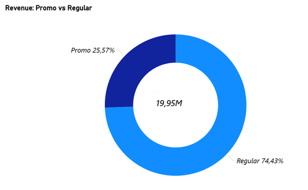

## Аналіз продажів FMCG-сектору (2022-2024)
 Роль: Junior Data Analyst
 
 Інструменти: PostgreSQL (Server), DBeaver, MS Excel, Power BI.
 
## Частина 1: Інженерія даних та ETL-процеси
  &nbsp;&nbsp;&nbsp;&nbsp;В процесі імпорту первинного масиву з MS Excel було виявлено та усунено конфлікти форматів. Помилку виправлено шляхом завантаження сирих даних у текстовому буфері безпосередньо в PostgreSQL із подальшою типізацією. Текстові часові мітки первинного масиву було явним приведенням типів конвертовано у системний формат `DATE`. 
  
  &nbsp;&nbsp;&nbsp;&nbsp;Для оптимізації роботи BI-системи було прийнято рішення змінити гранулярність даних із транзакційного рівня на денний. На рівні бази даних створено аналітичну вітрину у вигляді представлення `v_fmcg_sales_mart`. Це дозволило скоротити обсяг даних, що завантажуються до Power BI, приблизно на 35%.

```sql
CREATE OR REPLACE VIEW public.v_fmcg_sales_mart AS
SELECT 
    "date",
    brand,
    category,
    channel,
    region,
    promotion_flag,
    SUM(units_sold) AS total_units_sold,
    SUM(units_sold * price_unit)::NUMERIC(10,2) AS total_revenue
FROM public.fmcg_sales_raw
GROUP BY 
    "date", brand, category, channel, region, promotion_flag;
```

&nbsp;&nbsp;&nbsp;&nbsp;Для винесення складних розрахунків динаміки продажів на рівень СУБД створено представлення v_monthly_growth_analysis. Розрахунок щомісячного темпу приросту виторгу реалізовано за допомогою аналітичної віконної функції LAG().

```sql
CREATE OR REPLACE VIEW public.v_monthly_growth_analysis AS
WITH monthly_revenue AS (
    SELECT 
        EXTRACT(YEAR FROM "date")::INT AS sale_year,
        EXTRACT(MONTH FROM "date")::INT AS sale_month,
        SUM(total_revenue) AS current_month_revenue
    FROM public.v_fmcg_sales_mart
    GROUP BY EXTRACT(YEAR FROM "date"), EXTRACT(MONTH FROM "date")
)
SELECT 
    sale_year,
    sale_month,
    current_month_revenue,
    LAG(current_month_revenue) OVER (
        PARTITION BY sale_year 
        ORDER BY sale_month
    ) AS prev_month_revenue,
    ROUND(
        ((current_month_revenue - LAG(current_month_revenue) OVER (PARTITION BY sale_year ORDER BY sale_month)) 
        / LAG(current_month_revenue) OVER (PARTITION BY sale_year ORDER BY sale_month)) * 100, 2
    ) AS growth_percentage
FROM monthly_revenue;
```

## Частина 2: Моделювання даних у Power BI

&nbsp;&nbsp;&nbsp;&nbsp;Для забезпечення коректної взаємодії між аналітичними представленнями було налаштовано зв'язки між таблицями в Power BI. 
&nbsp;&nbsp;&nbsp;&nbsp;Зв'язок між вітринами реалізовано через поле року. Оскільки дані імпортувалися вже агрегованими, для інтеграції використано тип зв'язку багато до багатьох. Для коректної роботи зрізів років використано двосторонню крос-фільтрацію (Both).

## Частина 3: Бізнес-аналіз та інсайти
&nbsp;&nbsp;&nbsp;&nbsp;Загальний обсяг виторгу мережі за трирічний період склав 19.95 мільйонів грошових одиниць при 4 мільйонах штук відвантаженого товару.


Рисунок 1 – Загальний виторг та обсяг товару

&nbsp;&nbsp;&nbsp;&nbsp;У 2022 році спостерігається стійке щомісячне зростання виторгу. Найвищих показників продажі досягли у 2023 році. На початку 2024 року позитивна динаміка зберігалася, однак починаючи з травня обсяг виторгу поступово знизився відносно попереднього року



Рисунок 2 – Тренд виторгу по місяцях у річному зіставленні


## Аналіз сезонності (МоМ)
&nbsp;&nbsp;&nbsp;&nbsp;Розраховані за допомогою віконних функцій показники підтверджують наявність стійких сезонних циклів. Березень є найпродуктивнішим місяцем досліджуваного періоду та формує виражений весняний пік попиту, з рекордним стрибком у березні 2022 року на +197,76%.



Рисунок 3 – Темп приросту виторгу відносно попереднього місяця

&nbsp;&nbsp;&nbsp;&nbsp; Починаючи з вересня, графік входить у зону від'ємних значень, що відображає системний осінній спад попиту для даної бізнес-моделі. Завершення річного циклу в грудні стабільно характеризується відновленням показників за рахунок передноворічного святкового попиту.

## Структура портфеля та канали продажів
&nbsp;&nbsp;&nbsp;&nbsp; Абсолютним лідером за досліджуваний період став бренд SnBrand2, який піднявся з позиції аутсайдера у 2022 році на перше місце у 2023–2024 роках.



Рисунок 4 - Аналіз структури продажів за брендами

&nbsp;&nbsp;&nbsp;&nbsp; Найбільш стабільні показники демонструє бренд YoBrand4. Бренди MiBrand2 та SnBrand3 стабільно генерують мінімальний дохід, що вказує на доцільність проведення асортиментного аудиту.
Паралельно з цим, аналіз операційного контуру виявляє унікальну для ритейлу закономірність - абсолютну рівність між усіма трьома каналами збуту. Протягом 2022-2024 років частки традиційного роздрібу, електронної комерції та спеціалізованих дисконтних програм залишаються незмінними і стабільно займають по 33.3% від загального обсягу виторгу. Така збалансованість є ознакою стійкості бізнес-моделі: компанія однаково ефективно оперує на кожному майданчику, повністю нівелюючи ризик фінансового просідання у разі системної кризи в одному конкретному каналі. 
&nbsp;&nbsp;&nbsp;&nbsp;Серед каналів продажів традиційний роздріб (Retail), електронна комерція (E-commerce) та дисконтні програми (Discount) демонструють максимально близькі обсяги виторгу без чітко вираженого домінування одного з них, стабільно утримуючи частки в районі 33.3% від загального обсягу



Рисунок 5 - Структура виторгу за операційними каналами збуту

## Оцінка маркетингової ефективності 
&nbsp;&nbsp;&nbsp;&nbsp; Аналіз показав, що базові продажі за регулярною ціною формують 74.43% від загального виторгу. Близько 25.57% виторгу припадає на промо-акції та маркетингові активності, що свідчить про помітний внесок дисконтних програм у загальний результат продажів при збереженні високої самостійної цінності брендового портфеля для споживачів.



Рисунок 6 - Співвідношення акційного та регулярного виторгу

## Частина 4: Загальні рекомендації
&nbsp;&nbsp;&nbsp;&nbsp; На основі проведеного дослідження сформовано три стратегічні рекомендації для керівництва:
1.	Стабілізація продажів: Комерційному департаменту необхідно провести ревізію цінової політики та асортименту для усунення спаду продажів, що намітився з травня 2024 року.
2.	Оптимізація портфеля: Перерозподілити частину маркетингового бюджету на підтримку середньої ланки брендів для зниження залежності від лідерів (SnBrand2 та групи Yo).
3.	Фінансовий аудит каналів збуту: Провести поглиблений аналіз каналів продажів у розрізі чистого прибутку, оскільки рівність часток у виторгу не гарантує однакової маржинальності через різні витрати на логістику та утримання платформ.


 *Для зручного читання в офлайн-форматі Ви можете завантажити повний звіт у форматі [MS Word (DOCX)](Analysis_FMCG_Sales.docx).*
